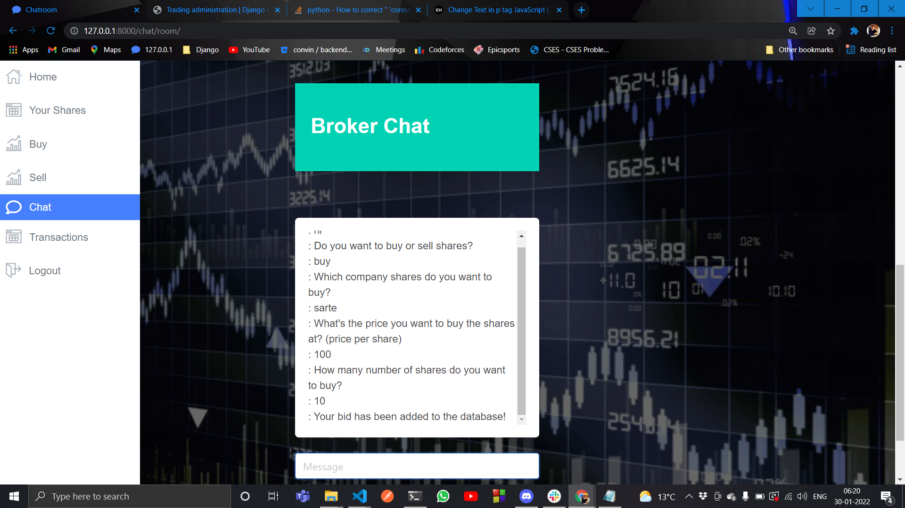
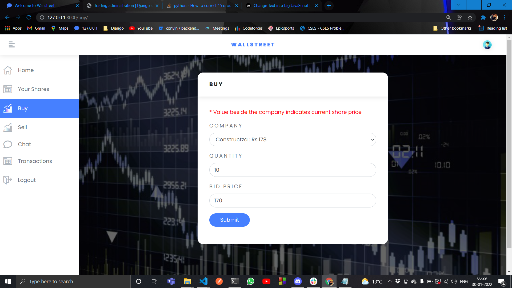
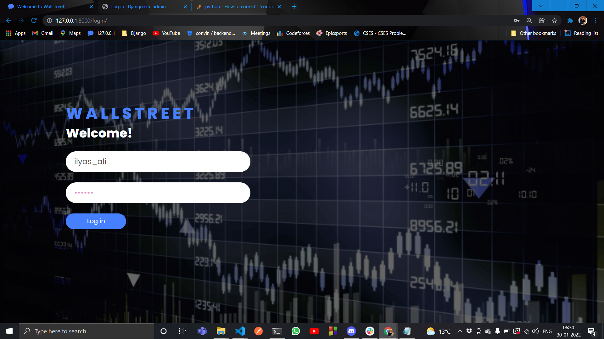
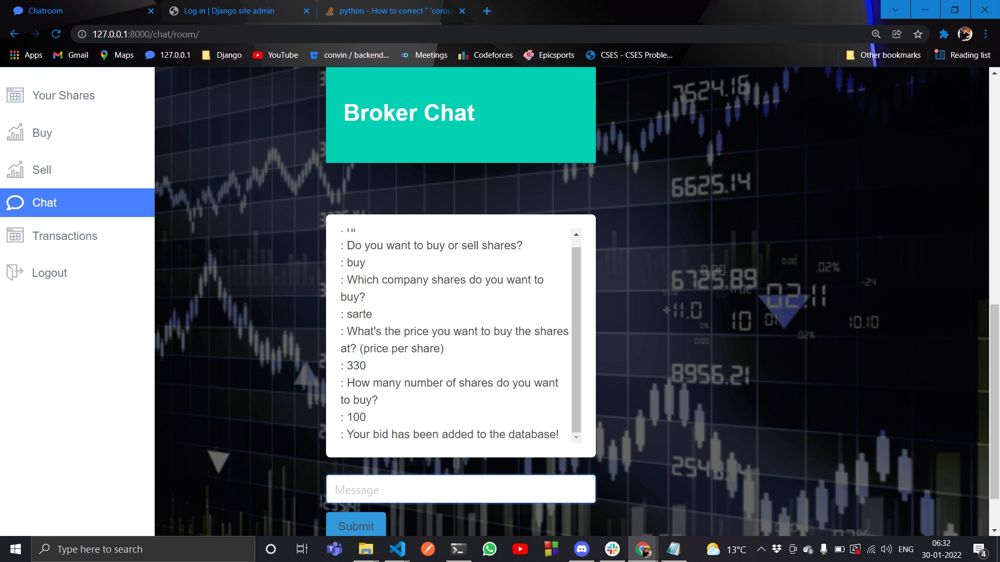
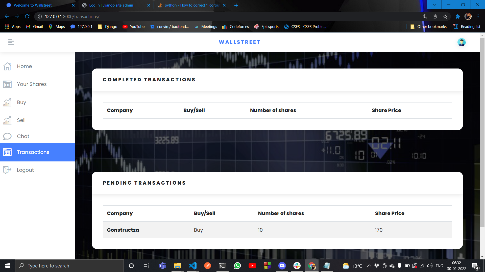
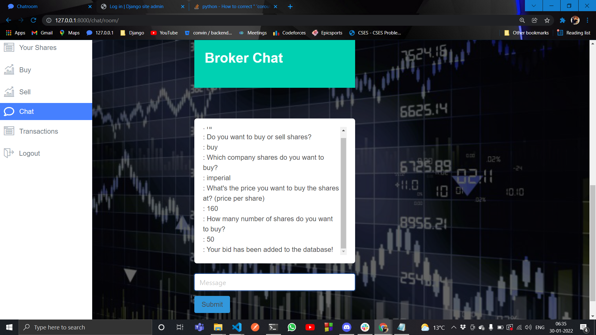
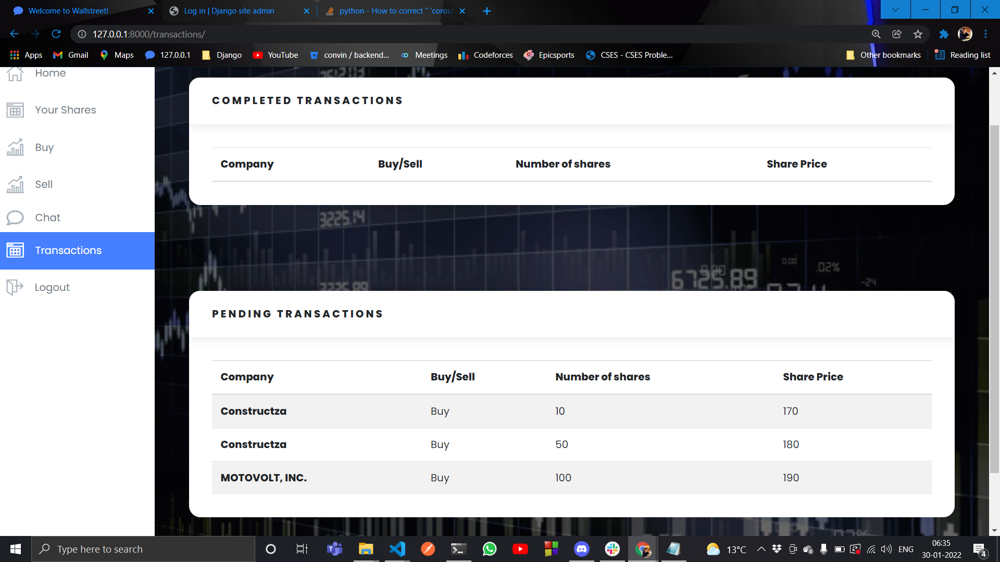
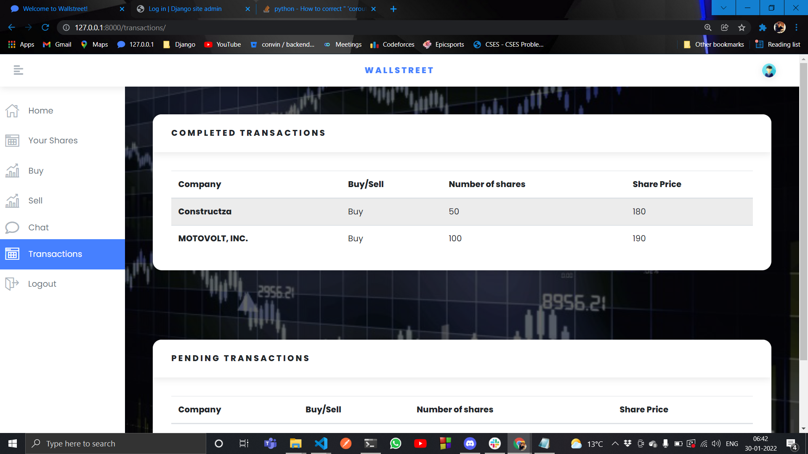

# wallstreet-chatbot

**Team Name**: Array of Hope

## Team members:

- [Mufaddal Diwan](https://github.com/mufaddal12)
- [Kirti Palve](https://github.com/kirtipalve)
- [Ilyas Ali](https://github.com/ilyas-ali)

## Running the app:

### Terminal 1

- `virtualenv env -p python3.8`
- `source env/bin/activate`
- `pip install -r requirements.txt`
- `python manage.py makemigrations`
- `python manage.py migrate --run-syncdb`
- `python manage.py shell`
  - `from trading.utility import add_company`
  - `add_company("")`
  - `exit()`
- `python manage.py makemigrations`
- `python manage.py migrate --run-syncdb`
- `python manage.py collectstatic`
- `python manage.py runserver`

### Terminal 2

- `redis-server`

### Terminal 3

- `celery -A wallstreet_chatbot worker --pool=eventlet -l info`

### Terminal 4

- `celery -A wallstreet_chatbot beat -l info`

## Our Product

Generally, this product is for a broker who has many customers and they need to buy and sell stocks/shares of any company at any time. The Broker has to manage all this, all the while increasing the profits. To make the work easier for the broker, this piece of software is made. To add, a chatting feature is added too, to allow his clients to have a conversation with his bot that can buy/sell their stocks on demand while chatting.

## Screenshots

- 

- 

- 

- 

- 

- 

- 

- 

- 

- 

- 

- 
